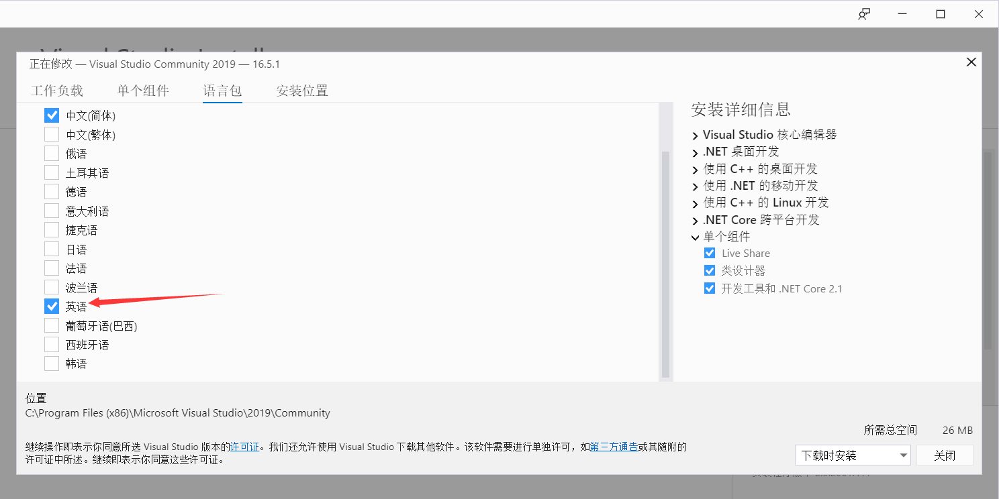
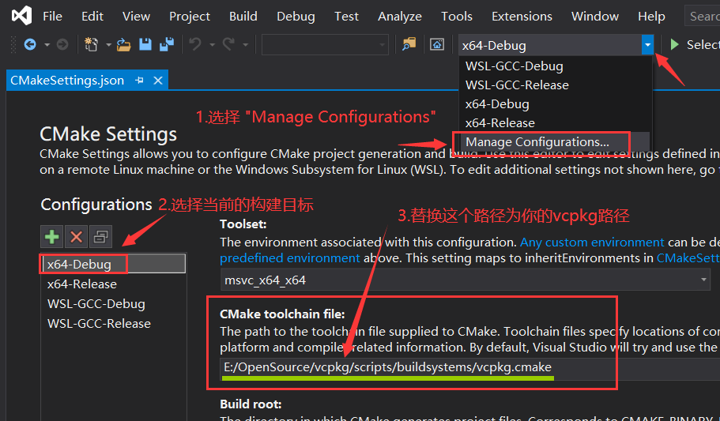
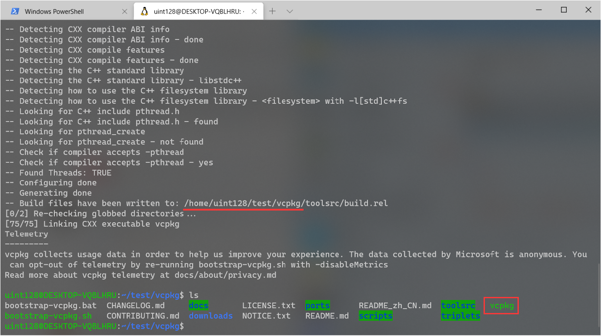
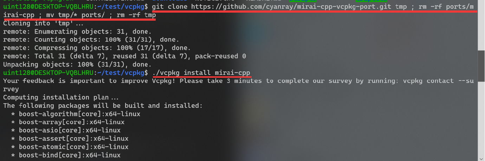
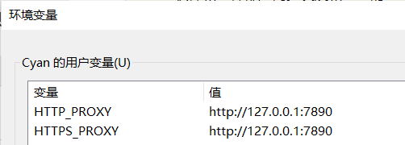

# mirai-cpp

## 项目简介

[mirai](https://github.com/mamoe/mirai) 是全开源 QQ 机器人 / QQ 协议支持库。

本项目为 mirai-http-api 的 C++ 封装，方便使用 C++ 开发 mirai-http-api 插件

## 项目依赖

1. **libcurl** HTTP 协议。

2. [**nlohmann/json**](https://github.com/nlohmann/json) 解析 JSON 数据。

3. [**CURLWrapper**](https://github.com/cyanray/CURLWrapper) 对 **libcurl** 的封装。

4. **boost/asio/thread_pool** 异步处理消息。

## 项目文档

[使用说明](doc/使用说明.md)

## 如何使用

### 1. 快速尝试

<details>

（以下内容基于 Windows 10 平台，使用 Visual Studio 2019 作为开发软件。）

本项目使用了 4 个第三方项目，其中 **CURLWrapper** 已经嵌入到本项目，而 **libcurl** 、**boost/asio** 以及 **nlohmann/json** 需要额外安装。

有很多方法可以在你的电脑上下载并安装这几个库，这里介绍一种更不容易出错的方法。

在这一切开始之前，你需要下载并安装 [**Git for windows**](https://gitforwindows.org/), 如果你已经安装并且很熟悉它，那么可以略过这个步骤。如果你不熟悉，在这之后可以去了解一下什么是 **Git** 。

然后，我们需要安装 [**vcpkg**](https://github.com/microsoft/vcpkg) , 这是一个来自微软的跨平台的 C++ 库管理器。如果你已经安装了 **vcpkg** 并且很熟悉它，那么可以略过这个步骤。

#### (1) 安装 **vcpkg** (如果你已经安装则可以略过)

1. 打开 Powershell ，找到一个合适的位置，执行以下命令：

```powershell
git clone https://github.com/Microsoft/vcpkg.git
cd vcpkg
.\bootstrap-vcpkg.bat
```

2. 如果上面的代码执行无误，那么 **vcpkg** 已经成功编译。执行下面的命令让 **Visual Studio 2019** 与 **vcpkg** 相关联

```powershell
.\vcpkg integrate install
```

3. 如果你使用的中文 Visual Studio，因为没有安装英文语言包，vcpkg 可能会无法正常工作。请打开 Visual Studio Installer 安装英文语言包(只需要安装英文语言包，不需要把 Visual Studio 切换为英文)




#### (2) 使用 **vcpkg** 安装 **mirai-cpp**

这一步稍微复杂，你需要执行(这里一定要在 **Powershell** 里面执行)：

```powershell
git clone https://github.com/cyanray/mirai-cpp-vcpkg-port.git tmp ;  mv tmp/* ports/ ; rm -Recurse -Force tmp

./vcpkg install mirai-cpp

# 对于 x64 的项目，还需要执行: 
#./vcpkg mirai-cpp:x64-windows
```

耐心等待，上面的指令会帮你安装 mirai-cpp 以及它的依赖项目。

#### (3) 在 **Visual Studio** 中创建一个项目，开始使用

尝试以下代码：

```c++
#include <iostream>
#include <mirai.h>

int main()
{
    using namespace std;
    using namespace Cyan;
    system("chcp 65001");
    MiraiBot bot("127.0.0.1",8080);
    while (true)
    {
        try
        {
            bot.Auth("InitKeyVl0CEUzZ", 2110000000_qq);
            break;
        }
        catch (const std::exception & ex)
        {
            cout << ex.what() << endl;
        }
    }
    cout << "Bot Working..." << endl;

    bot.On<FriendMessage>(
        [&](FriendMessage m)
        {
            // bot.SendMessage(fm.Sender.QQ, fm.MessageChain);
            m.Reply(m.MessageChain);
        });

    bot.On<GroupMessage>(
        [&](GroupMessage m)
        {
            // bot.SendMessage(gm.Sender.Group.GID, "What is " + gm.MessageChain);
            m.QuoteReply("What is " + m.MessageChain);
        });

    bot.EventLoop();

    return 0;
}
```

以上代码你很可能会编译错误，因为 mirai-cpp 的源文件采用了 UTF-8 格式保存。

MSVC 并没有默认启动对 UTF-8 编码的支持。

要想成功通过编译，需要在 C++ 编译器的命令行中添加 **/utf-8** 参数。

1. 在 Visual Studio 开发环境中设置此编译器选项
2. 打开项目“属性页” 对话框。 
3. 展开 "配置属性, C/C++ ,命令行" 文件夹。
4. 在 "其他选项" 中, 添加 /utf-8选项以指定首选编码。
5. 选择“确定”以保存更改。

如图:


更多信息可以参考: [https://docs.microsoft.com/zh-cn/cpp/build/reference/utf-8-set-source-and-executable-character-sets-to-utf-8?view=vs-2019](https://docs.microsoft.com/zh-cn/cpp/build/reference/utf-8-set-source-and-executable-character-sets-to-utf-8?view=vs-2019) 

如果一切正常，给你的机器人发消息，他会回复同样的消息给你！

> 提示: 添加了编译参数 **/utf-8** 后，**你的项目**的**源文件的编码**也必须是 **UTF-8** 编码，不然会出现编译错误。中文操作系统下，Visual Studio 创建的源文件默认为 **GB2312** 编码。所以你需要手动地修改**你的项目**的源文件为 **UTF-8** 编码。


</details>


### 2. 快速尝试2

<details>

#### (1) 安装 **vcpkg** (如果你已经安装则可以略过)

1. 打开 Powershell ，找到一个合适的位置，执行以下命令：

```powershell
git clone https://github.com/Microsoft/vcpkg.git
cd vcpkg
.\bootstrap-vcpkg.bat
```

2. 如果上面的代码执行无误，那么 **vcpkg** 已经成功编译。执行下面的命令让 **Visual Studio 2019** 与 **vcpkg** 相关联

```powershell
.\vcpkg integrate install
```

3. 如果你使用的中文 Visual Studio，因为没有安装英文语言包，vcpkg 可能会无法正常工作。请打开 Visual Studio Installer 安装英文语言包(只需要安装英文语言包，不需要把 Visual Studio 切换为英文)


#### (2) 使用 **vcpkg** 安装 **mirai-cpp** 的依赖项目

```powershell
./vcpkg install nlohmann-json curl boost-asio
```

耐心等待，上面的指令会帮你安装 mirai-cpp 的依赖项目。

#### (3) 直接开始体验 mirai-cpp

将本仓库克隆到合适的位置

```powershell
git clone https://github.com/cyanray/mirai-cpp.git
```

如果一切顺利，你已经将本仓库的所有内容克隆到了 mirai-cpp 文件夹里。

如图所示，使用 Visual Studio 2019 直接打开这个文件夹。


之后，需要设置一下 CMake Toolchain File，按照图中的步骤操作。

> 提示: 把图中 `E:/OpenSource/vcpkg/` 替换为你的 vcpkg 文件夹的路径。比如替换成 `D:/vcpkg/scripts/buildsystems/vcpkg.cmake`



如果一切顺利，你就可以直接运行我写好的示例。


</details>

### 3. 其他使用方式

#### (1) 更新 mirai-cpp

在更新 mirai-cpp 之前，需要先删除已经安装的 mirai-cpp

Windows:

```powershell
./vcpkg remove mirai-cpp mirai-cpp:x64-windows
```

Linux:

```bash
./vcpkg remove mirai-cpp
```

删除之后，重新安装即可:

Windows:

```powershell
git clone https://github.com/cyanray/mirai-cpp-vcpkg-port.git tmp ; rm -Recurse -Force ports/mirai-cpp ; mv tmp/* ports/ ; rm -Recurse -Force tmp

./vcpkg install mirai-cpp mirai-cpp:x64-windows
```

Linux:
```bash
git clone https://github.com/cyanray/mirai-cpp-vcpkg-port.git tmp ; rm -rf ports/mirai-cpp ; mv tmp/* ports/ ; rm -rf tmp
./vcpkg install mirai-cpp
```

#### (2) 将程序轻松移植、部署到 Linux 上

<details>

(以下内容基于 “快速尝试2”，请先完成“快速尝试2”。)

上面的内容介绍了如何在 Windows 上开发使用 mirai-cpp 的程序，下面来介绍如何将你的程序移植到 Linux 平台，以便将程序部署到 Linux 服务器上。

为了易于讲解与操作，以下内容在 **WSL** (**W**indows **S**ubsystem for **L**inux) 上进行。这里不对如何安装 WSL 进行说明，关于如何安装 WSL 还请自行查阅资料。

1. 在 WSL 上安装 vcpkg

步骤与上文类似，但是略有不同:

```bash
git clone https://github.com/Microsoft/vcpkg.git
cd vcpkg
./bootstrap-vcpkg.sh
```


耐心等待，其结果如图所示。
注意，如果执行 ls 发现没有生成 vcpkg 的可执行文件，请尝试重新执行上述的安装指令。(这似乎是个bug)



2. 使用 vcpkg 安装 mirai-cpp 


```bash
git clone https://github.com/cyanray/mirai-cpp-vcpkg-port.git tmp ;  mv tmp/* ports/ ; rm -rf tmp

./vcpkg install mirai-cpp
```



3. 创建针对 WSL 的配置

打开在 “快速尝试2” 中用到的项目。按照如图所示步骤，创建一个针对 WSL 平台的配置。因为我的 WSL 安装了 GCC 编译器，所以这里选择 **WSL-GCC-Releas**。


和 “快速尝试2” 一样的操作，配置 CMake Toolchain File。但是这次的路径要填写 WSL 上的路径。


Enjoy it;

</details>

## 常见问题

### 1. 使用 vcpkg 安装 mirai-cpp 时出错

首先检查是不是网络错误导致下载文件失败。这种错误只要重新执行 `./vcpkg install mirai-cpp` 。如果你有可以加速网络的代理服务器，可以添加 **HTTP_PROXY** 和 **HTTPS_PROXY** 环境变量，以加速 **vcpkg** 的下载。



## 代码风格

本项目的代码使用的是我自己喜欢的代码风格，如果你有更好的建议（比如修改为 Google-Style），欢迎提出 issues 或 pull request。

## 其他

未完待续……
