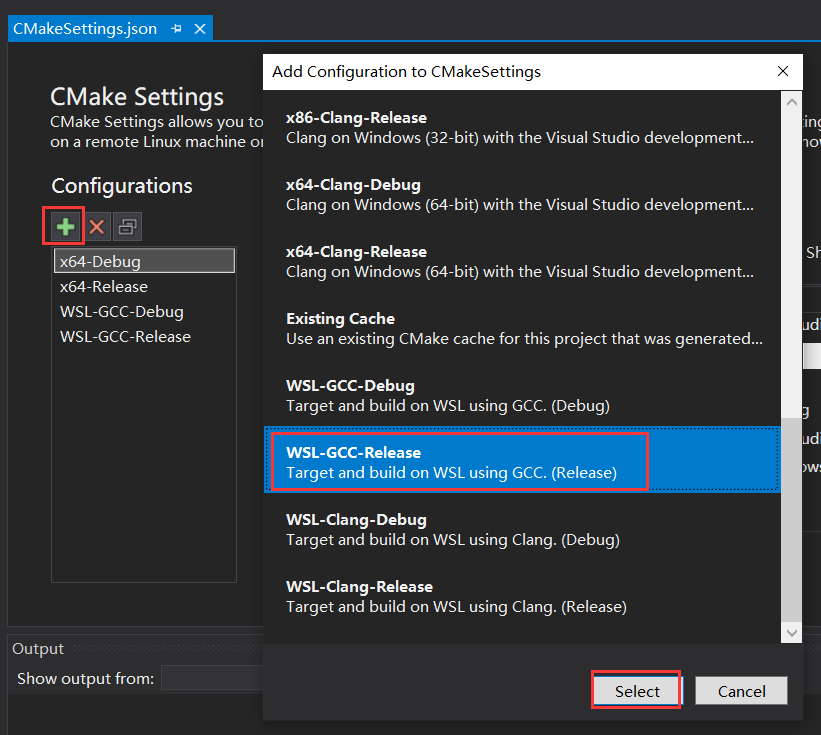

# mirai-cpp

## 项目简介

[mirai](https://github.com/mamoe/mirai) 是全开源 QQ 机器人 / QQ 协议支持库。

本项目为 mirai-http-api 的 C++ 封装，方便使用 C++ 开发 mirai-http-api 插件

## 项目依赖

> 本项目所有依赖都为 Header-Only 库，已经内置到本项目的 third-party 文件夹中。

1. [**cpp-httplib**](https://github.com/yhirose/cpp-httplib) A C++ header-only HTTP/HTTPS server and client library.

2. [**nlohmann/json**](https://github.com/nlohmann/json) 解析 JSON 数据。

3. [**ThreadPool**](https://github.com/cyanray/CURLWrapper) 线程池库，用于异步处理消息。

## 项目文档

[使用说明](doc/使用说明.md)

## 如何使用

### 1. 快速尝试

将本仓库克隆到合适的位置

```powershell
git clone https://github.com/cyanray/mirai-cpp.git
```

如果一切顺利，你已经将本仓库的所有内容克隆到了 mirai-cpp 文件夹里。

如图所示，使用 Visual Studio 2019 直接打开这个文件夹。


如果一切顺利，你可以直接运行我写好的示例。

在我的示例的基础上进行修改，即可编写你自己的插件。


### 3. 其他使用方式

#### (1) 将程序轻松移植、部署到 Linux 上


(以下内容基于 “快速尝试”，请先完成“快速尝试”。)

上面的内容介绍了如何在 Windows 上开发使用 mirai-cpp 的程序，下面来介绍如何将你的程序移植到 Linux 平台，以便将程序部署到 Linux 服务器上。

为了易于讲解与操作，以下内容在 **WSL** (**W**indows **S**ubsystem for **L**inux) 上进行。这里不对如何安装 WSL 进行说明，关于如何安装 WSL 还请自行查阅资料。

1. 创建针对 WSL 的配置

打开在 “快速尝试” 中用到的项目。按照如图所示步骤，创建一个针对 WSL 平台的配置。因为我的 WSL 安装了 GCC 编译器，所以这里选择 **WSL-GCC-Releas**。



如果一切顺利，等待 CMake 缓存生成成功后，即可编译出 Linux 平台的可执行文件。

## 常见问题

未完待续……

## 代码风格

本项目的代码使用的是我自己喜欢的代码风格，如果你有更好的建议（比如修改为 Google-Style），欢迎提出 issues 或 pull request。

## 其他

未完待续……
