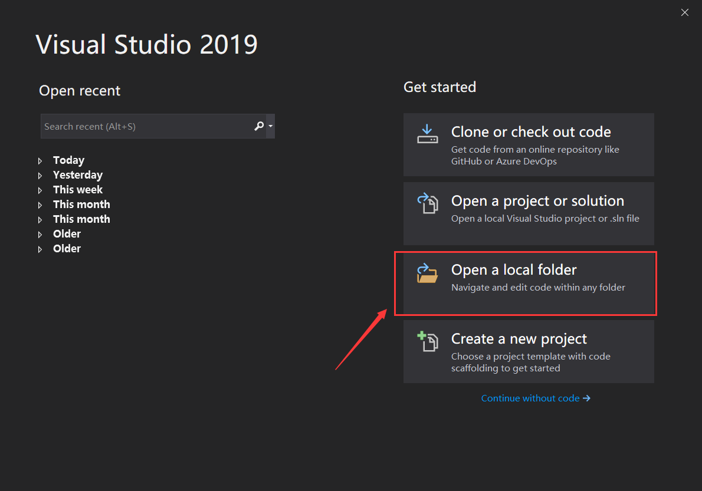
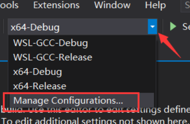
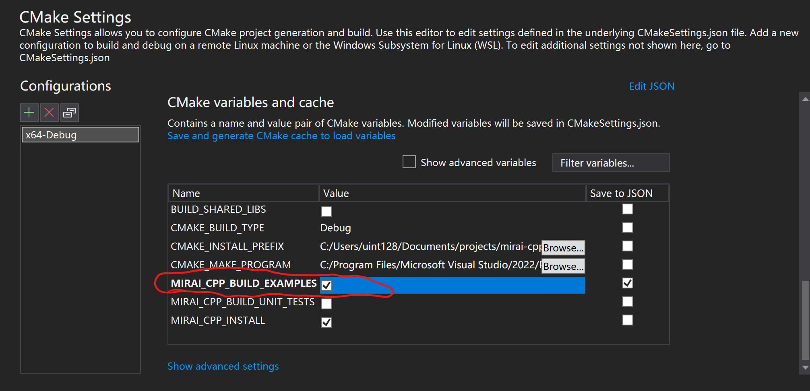
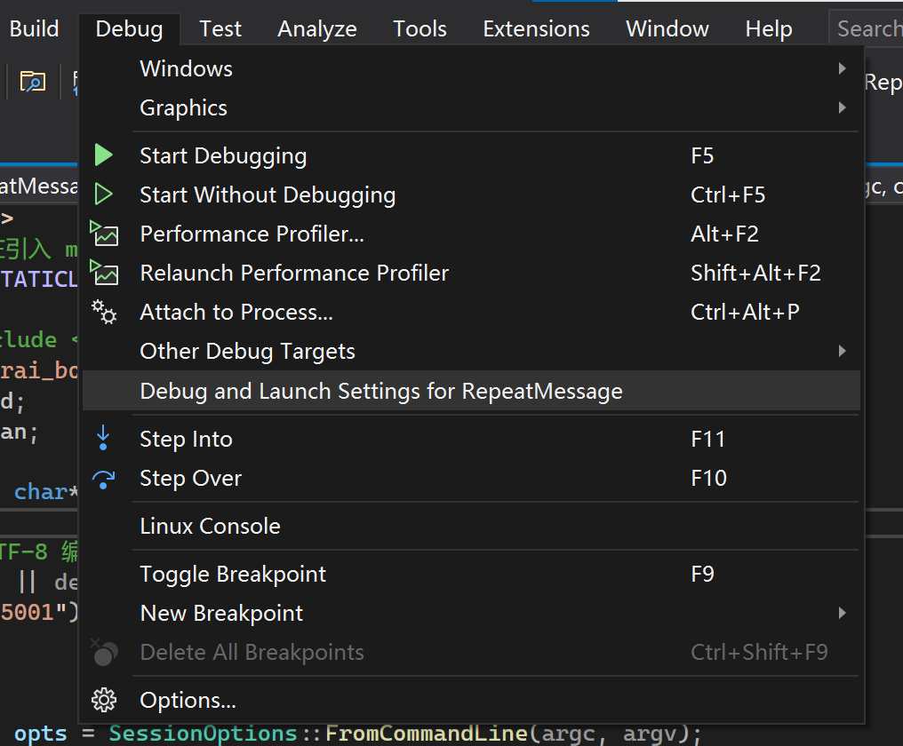
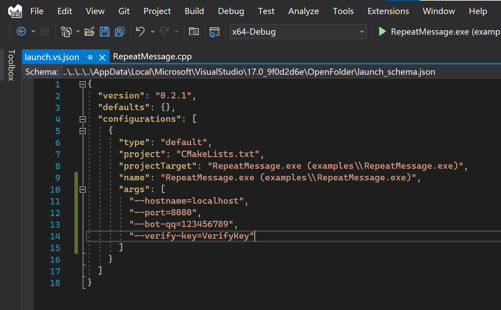
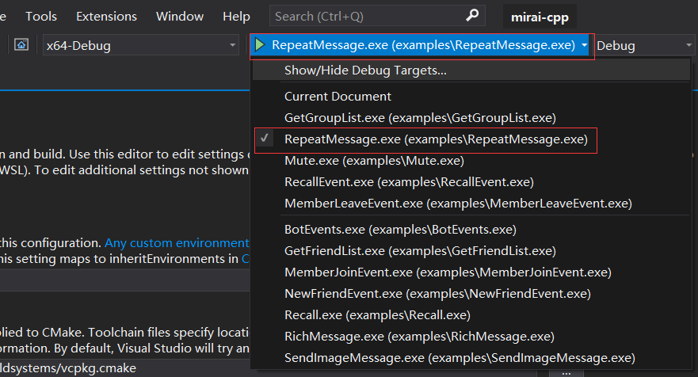

# mirai-cpp


## 0x01 项目简介

[mirai](https://github.com/mamoe/mirai) 是全开源 QQ 机器人 / QQ 协议支持库。(使用Kotlin编写)

[mirai-api-http](https://github.com/project-mirai/mirai-api-http) 提供一系列 HTTP API 以便其他语言使用 mirai。

本项目为 mirai-api-http 的 C++ 封装，方便使用 C++ 开发基于 mirai-api-http 的插件。

**在使用 mirai-cpp 和基于 mirai-cpp 的插件之前，你需要配置好 [mirai-console](https://github.com/mamoe/mirai-console) 并且安装 [mirai-api-http](https://github.com/project-mirai/mirai-api-http) 插件。**

## 0x02 特性

* C++17;
* 内置所有依赖库;
* 容易使用，丰富的示例；
* 与 mirai-api-http 同步更新(使用相同版本号，保证兼容性);
* 对 mirai-api-http 进行完全地封装(支持其所有功能、事件);

## 0x03 快速入门

使用 mirai-cpp 需要你熟悉 C++ 最基本的用法。

mirai-cpp 的工作依赖 mirai-api-http 的 http 适配器和 ws 适配器。mirai-cpp 通过 http 进行发送消息等操作，通过 ws 接收事件和消息。

下面的代码实现了一个最简单的”复读机“机器人，机器人账号收到任何好友私聊、群组消息或者临时消息，都会把同样的消息内容发送回去。

```c++
#include <iostream>
// 静态链接 mirai-cpp 要在引入头文件前定义这个宏
#define MIRAICPP_STATICLIB
#include <mirai.h>
using namespace std;
using namespace Cyan;
int main(int argc, char* argv[])
{
    MiraiBot bot;
    SessionOptions opts = SessionOptions::FromCommandLine(argc, argv);
    bot.Connect(opts);
    cout << "Bot working..." << endl;
    bot.On<Message>(
        [](Message m)
        {
            m.Reply(m.MessageChain);
        });
    char ch;
    while ((ch = getchar()) != 'q');
    bot.Disconnect();
}
```

你需要重点关注 `MiraiBot` 类以及它的 `On<T>` 函数。

[MiraiBot](https://github.com/cyanray/mirai-cpp/blob/master/include/mirai/mirai_bot.hpp) 类提供了诸如发送消息、获取好友列表等函数，这个函数列表可以在 [mirai-api-http](https://github.com/project-mirai/mirai-api-http/blob/master/docs/api/API.md) 的文档里查到。

因为其中的函数数量比较多，而且作者精力有限，因此不提供详细的使用文档，具体如何使用请查看 [MiraiBot](https://github.com/cyanray/mirai-cpp/blob/master/include/mirai/mirai_bot.hpp) 类的注释以及 [examples](https://github.com/cyanray/mirai-cpp/tree/master/examples) 目录里的示例。

你可能想了解：
* [详细示例(简易复读机Bot)](https://github.com/cyanray/mirai-cpp/blob/master/examples/RepeatMessage.cpp)
* [详细文档](doc/Documentation.md)
* [如何与mirai-api-http建立连接](doc/Documentation.md#如何与mirai-api-http建立连接)
* [如何接收、处理事件](doc/Documentation.md#如何接收、处理事件)
* [如何发送消息、引用回复、撤回消息](doc/Documentation.md#如何发送消息、引用回复、撤回消息)
* [如何处理失去连接的情况](doc/Documentation.md#处理失去连接的情况)

## 0x04 如何编译、调试 mirai-cpp

### 1. 快速尝试 (运行 examples、参与开发)
<details>

#### (1) 使用 Visual Studio

1. 完整克隆/下载本仓库。

2. 如图所示，使用 Visual Studio 2019/2022 直接打开这个文件夹。



3. 如果要尝试 examples 请确保 MIRAI_CPP_BUILD_EXAMPLES 被勾上。





4. 由于所有的 examples 都从命令行读取配置，在调试之前需要编辑一下调试命令行。



5. 根据你的 mirai-api-http 设置，填入以下配置。

```json
"args": [
  "--hostname=localhost",
  "--port=8080",
  "--bot-qq=123456789",
  "--verify-key=VerifyKey"
]
```



6. 如果一切顺利，你可以直接运行我写好的示例，或者进行修改编写自己的机器人。



</details>


### **2. 创建自己的机器人项目**

#### (1) 使用 CMake Project 模板

具体参考 [mirai-cpp-template](https://github.com/cyanray/mirai-cpp-template) 的说明。


### 3. 其他使用方式

#### (1) 将程序移植、部署到 Linux 上

<details>

(以下内容基于 “快速尝试”，请先完成“快速尝试”。)

上面的内容介绍了如何在 Windows 上开发使用 mirai-cpp 的程序，下面来介绍如何将你的程序移植到 Linux 平台，以便将程序部署到 Linux 服务器上。

为了易于讲解与操作，以下内容在 **WSL** (**W**indows **S**ubsystem for **L**inux) 上进行。这里不对如何安装 WSL 进行说明，关于如何安装 WSL 还请自行查阅资料。

打开在 “快速尝试” 中用到的项目。按照如图所示步骤，创建一个针对 WSL 平台的配置。因为我的 WSL 安装了 GCC 编译器，所以这里选择 **WSL-GCC-Releas**。


如果一切顺利，等待 CMake 缓存生成成功后，即可编译出 Linux 平台的可执行文件。

</details>

#### (2) 使用 vcpkg 安装 mirai-cpp

> 不推荐，因精力有限 vcpkg 的更新可能不及时

要使用 vcpkg 管理 mirai-cpp，你需要将 [https://github.com/cyanray/mirai-cpp-vcpkg-port](https://github.com/cyanray/mirai-cpp-vcpkg-port) 中的 **mirai-cpp** 文件夹复制到 vcpkg 安装目录下的 **ports** 文件夹中。

然后就可以使用 `./vcpkg install mirai-cpp:x86-windows mirai-cpp:x64-windows` 安装 mirai-cpp。


## 0x05 项目依赖

> 本项目所有依赖都为 Header-Only 库，已经内置到本项目的 mirai/third-party 文件夹中。

1. [**yhirose/cpp-httplib**](https://github.com/yhirose/cpp-httplib) A C++ header-only HTTP/HTTPS server and client library.

2. [**nlohmann/json**](https://github.com/nlohmann/json) JSON for Modern C++.

3. [**progschj/ThreadPool**](https://github.com/progschj/ThreadPool) A simple C++11 Thread Pool implementation.

4. [**cyanray/LightWebSocketClient**](https://github.com/cyanray/LightWebSocketClient) A simple cross-platform WebSocket client.

5. [**Neargye/magic_enum**](https://github.com/Neargye/magic_enum) Static reflection for enums (to string, from string, iteration) for modern C++, work with any enum type without any macro or boilerplate code.

## 0x06 参与开发

mirai-cpp 目前还有许多不足，欢迎提出 issues 或 pull requests。

## 0x07 以下项目正在使用 mirai-cpp

> 如果你愿意分享你开发的程序，欢迎提出 issues 或 pull requests 在下方分享你的程序

1. [MocliaParseBot](https://github.com/Moclia-Developer-Team/MocliaParseBot): 基于Mirai-Api-Http和Mirai-cpp的全平台网络服务群QQ解析项目
2. [LGTBot-Mirai](https://github.com/Slontia/lgtbot-mirai): 基于mirai-cpp的游戏裁判机器人，可以在聊天室中开展游戏

