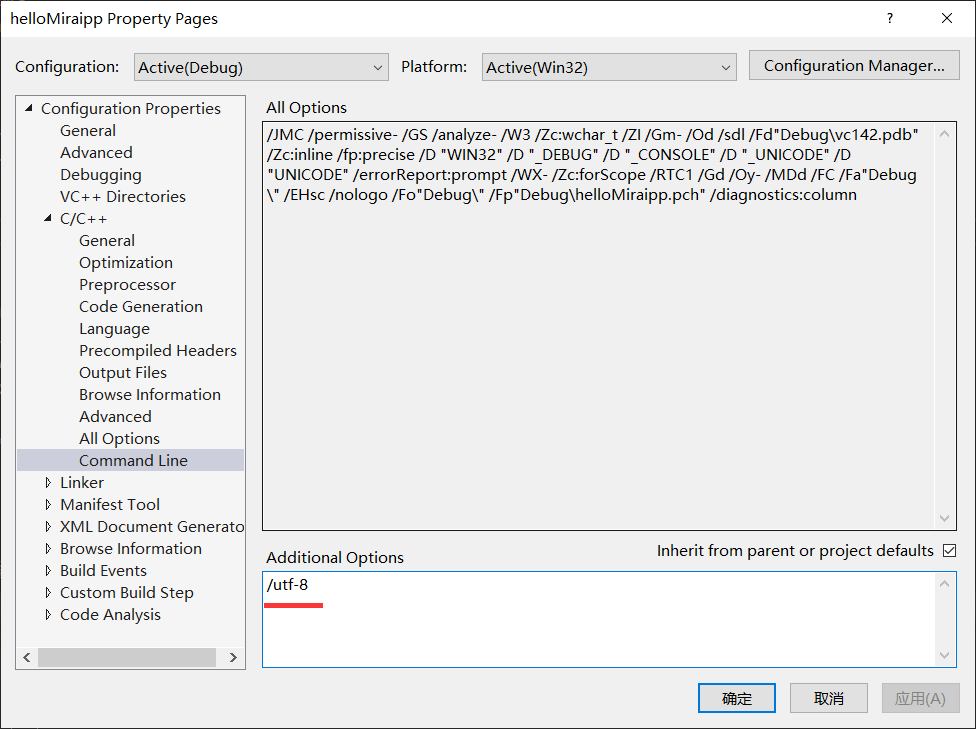

# mirai-cpp

## 项目简介

[mirai](https://github.com/mamoe/mirai) 是全开源 QQ 机器人 / QQ 协议支持库。

本项目为 mirai-http-api 的 C++ 封装，方便使用 C++ 开发 mirai-http-api 插件

## 项目依赖

1. **libcurl** HTTP 协议。

2. [**nlohmann/json**](https://github.com/nlohmann/json) 解析 JSON 数据。

3. [**CURLWrapper**](https://github.com/cyanray/CURLWrapper) 对 **libcurl** 的封装。

4. **boost/asio/thread_pool** 异步处理消息。

## 如何使用

### 1. 快速尝试

<details>

（以下内容基于 Windows 10 平台，使用 Visual Studio 2019 作为开发软件。）

本项目使用了 4 个第三方项目，其中 **CURLWrapper** 已经嵌入到本项目，而 **libcurl** 、**boost/asio** 以及 **nlohmann/json** 需要额外安装。

有很多方法可以在你的电脑上下载并安装这几个库，这里介绍一种更不容易出错的方法。

在这一切开始之前，你需要下载并安装 [**Git for windows**](https://gitforwindows.org/), 如果你已经安装并且很熟悉它，那么可以略过这个步骤。如果你不熟悉，在这之后可以去了解一下什么是 **Git** 。

然后，我们需要安装 [**vcpkg**](https://github.com/microsoft/vcpkg) , 这是一个来自微软的跨平台的 C++ 库管理器。如果你已经安装了 **vcpkg** 并且很熟悉它，那么可以略过这个步骤。

#### (1) 安装 **vcpkg** (如果你已经安装则可以略过)

1. 打开 Powershell ，找到一个合适的位置，执行以下命令：

```powershell
git clone https://github.com/Microsoft/vcpkg.git
cd vcpkg
.\bootstrap-vcpkg.bat
```

2. 如果上面的代码执行无误，那么 **vcpkg** 已经成功编译。执行下面的命令让 **Visual Studio 2019** 与 **vcpkg** 相关联

```powershell
.\vcpkg integrate install
```

#### (2) 使用 **vcpkg** 安装 **mirai-cpp**

这一步稍微复杂，你需要执行(这里一定要在 **Powershell** 里面执行)：

```powershell
git clone https://github.com/cyanray/mirai-cpp-vcpkg-port.git tmp ; rm -Recurse -Force ports/mirai-cpp ; mv tmp/* ports/ ; rm -Recurse -Force tmp
./vcpkg install mirai-cpp
# 如果你要构建 x64 平台的程序,需要执行:
# ./vcpkg install mirai-cpp:x64-windows
```

耐心等待，上面的代码会帮你安装 mirai-cpp 以及它的依赖项目。

#### (3) 在 **Visual Studio** 中创建一个项目，开始使用

尝试以下代码：

```c++
#include <iostream>
#include <mirai.hpp>

int main()
{
    using namespace std;
    using namespace Cyan;
    MiraiBot bot;
    while (true)
    {
        try
        {
            // InitKeyVl0CEUzZ 改为你的 InitKey，
            // 2110000000 改为你的 bot 的 QQ 号码
            // 提示: mirai-cpp 不支持隐式地将字面数字转化为 QQ_t 或 GID_t
            // 你需要给字面数字添加后缀 qq 或 _qq (gid 或 _gid), 将字面数字转化为 QQ_t (GID_t)
            // 如果想将 QQ_t(GID_t) 转化为数字，可以使用强制类型转换: 
            // QQ_t qq = 10001_qq;
            // int64_t qq_num = (int64_t)(qq);
            bot.Auth("InitKeyVl0CEUzZ", 2110000000qq);
            break;
        }
        catch (const std::exception & ex)
        {
            cout << ex.what() << endl;
        }
    }
    cout << "成功登录 bot。" << endl;


    bot.On<FriendMessage>(
        [&](FriendMessage fm)
        {
            // bot.SendFriendMessage(fm.Sender.QQ, fm.MessageChain);
            fm.Reply(fm.MessageChain);
        });

    bot.On<GroupMessage>(
        [&](GroupMessage gm)
        {
            // bot.SendGroupMessage(gm.Sender.Group.GID, "为什么要 " + gm.MessageChain);
            gm.QuoteReply("为什么要 " + gm.MessageChain);
        });

    bot.EventLoop();

    return 0;
}
```

以上代码你很可能会编译错误，因为 mirai-cpp 的源文件采用了 UTF-8 格式保存。

MSVC 并没有默认启动对 UTF-8 编码的支持。

要想成功通过编译，需要在 C++ 编译器的命令行中添加 **/utf-8** 参数。

1. 在 Visual Studio 开发环境中设置此编译器选项
2. 打开项目“属性页” 对话框。 
3. 展开 "配置属性, C/C++ ,命令行" 文件夹。
4. 在 "其他选项" 中, 添加 /utf-8选项以指定首选编码。
5. 选择“确定”以保存更改。

如图:



更多信息可以参考: [https://docs.microsoft.com/zh-cn/cpp/build/reference/utf-8-set-source-and-executable-character-sets-to-utf-8?view=vs-2019](https://docs.microsoft.com/zh-cn/cpp/build/reference/utf-8-set-source-and-executable-character-sets-to-utf-8?view=vs-2019) 

如果一切正常，给你的机器人发消息，他会回复同样的消息给你！

</details>

### 2. 其他使用方式

#### (1) 更新 mirai-cpp

在更新 mirai-cpp 之前，需要先删除已经安装的 mirai-cpp

```powershell
./vcpkg remove mirai-cpp
./vcpkg remove mirai-cpp:x64-windows # 如果有安装 mirai-cpp:x64-windows
```

删除之后，重新安装即可:

```powershell
git clone https://github.com/cyanray/mirai-cpp-vcpkg-port.git tmp ; rm -Recurse -Force ports/mirai-cpp ; mv tmp/* ports/ ; rm -Recurse -Force tmp
./vcpkg install mirai-cpp
# 如果你要构建 x64 平台的程序,需要执行:
# ./vcpkg install mirai-cpp:x64-windows
```

## 代码风格

本项目的代码使用的是我自己喜欢的代码风格，如果你有更好的建议（比如修改为 Google-Style），欢迎提出 issues 或 pull request。

## 其他

未完待续……
